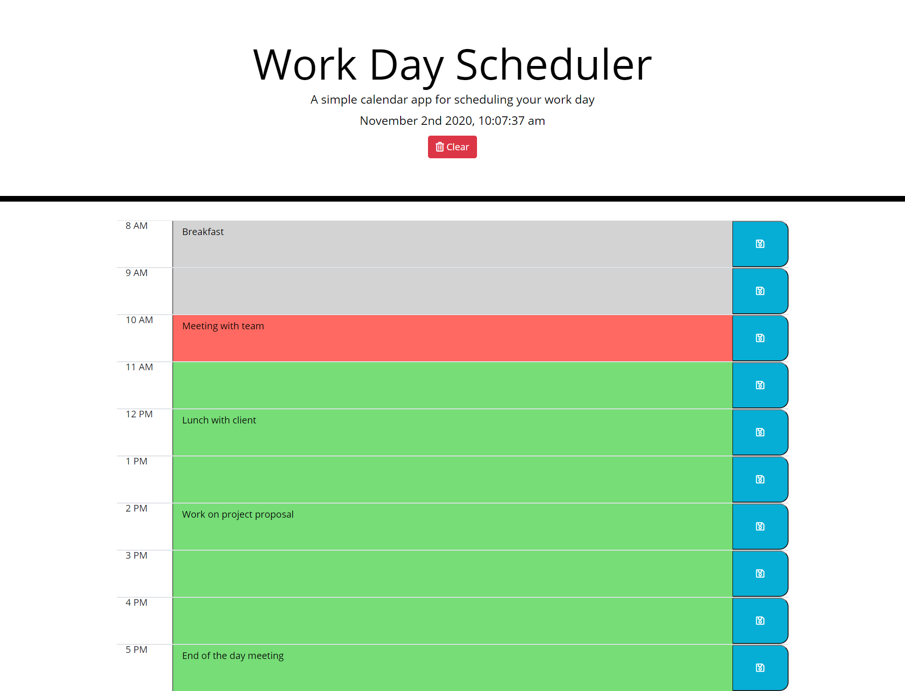

# Work-Day-Scheduler

The purpose of this project is to provide users with a day planner to keep track of their appointments and responsibilities on a given day. The user can easily distinguish past, present, and future times by the color coding. 

## Motivation
This project was created so that users can track meetings and appointments throughout their workday. 

 
## Screenshots

## Tech/framework used
Bootstrap
Moment.JS
Jquery
FontAwesome

## Features
This projects uses Moment.js to color code the calendar based on the current time of day. 

## Installation
Clone the repository from GitHub

## How to use?
You can find the application here https://liambambery23.github.io/Work-Day-Scheduler/
To use this application simply enter your meetings or whatever you would like into the proper hour and click the save button. If you need to clear all entries to the calendar, press the clear button. 

## Credits
https://github.com/Anil1992-rgb/Day-Planner
